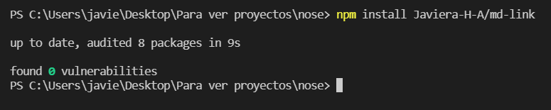
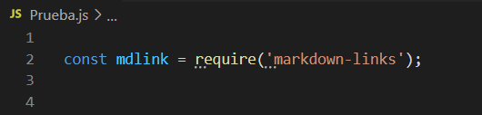
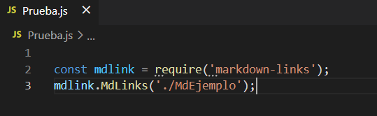
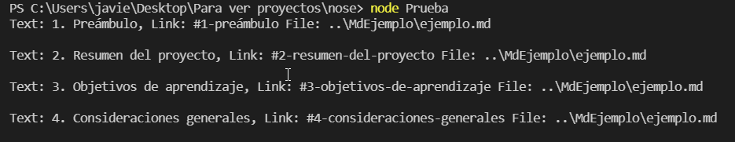
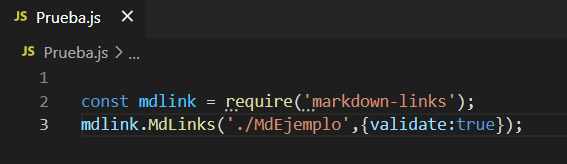
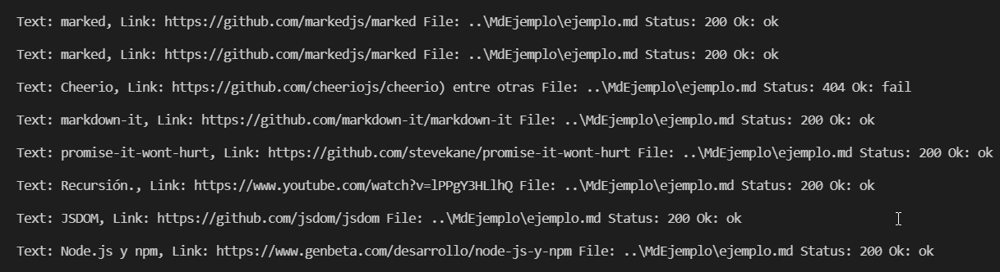
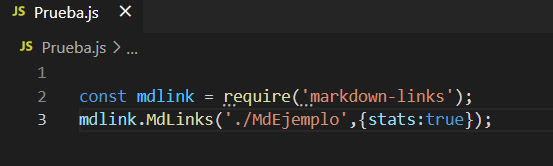
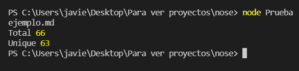

# Markdown Links
Esta librería te permitirá analizar los links dentro de tus archivos MarkDown, verificar su estado y entregar algunas estadísticas.

## INSTALACION

 * Ve al proyecto en el cual estas trabajando y en la terminal coloca el siguiente comando para instalar la libreria:
 ```sh
  npm install Javiera-H-A/md-link
 ```


## USO DE LA API 
 * Una vez hecho esto, debes importar el módulo para hacer uso de MdLinks se la siguiente forma:
```sh
  const mdlink = require('markdown-links');
```


* Luego puedes llamar a la función junto con sus argumentos, como se muestra a continuación:
```sh
  mdlink.MdLinks(path,options); 
```
* **path es la ruta a tu archivo o directorio** 
* **Las opciones pueden ser {validate:true} o {validate:false} (esta opción viene por defecto) o {stats:true}**

## Ejemplos 

* ###  Llamando a la funcion especificando solo el path: 




* ###  Llamando a la funcion con path y {validate:true}: 




* ###  Llamando a la funcion con path y {stats:true}:



